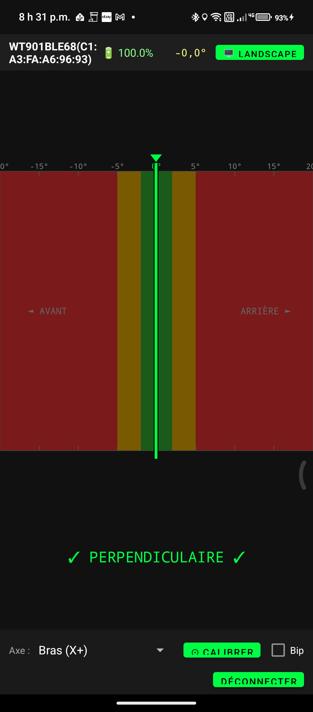

# ExcaLevel

Android app displaying a real-time horizontal level indicator for an excavator arm, using a WitMotion WT901BLECL5.0 BLE inclinometer sensor.

## Purpose

Know when the excavator arm is perpendicular to the ground (0° angle) without leaving the cabin. The display resembles a laser level receiver: a colored bar showing deviation left/right from the target position, with an audible beep when in the green zone.



## Hardware

- **Sensor**: WitMotion WT901BLECL5.0 — 9-axis inclinometer, Bluetooth 5.0 BLE
- **Mounting**: The sensor attaches to the arm via its built-in plastic rings using straps. Mounted on its side, the **X axis** is the primary measurement axis
- **Phone**: Android 6.0+ (API 23), Bluetooth 5.0 BLE

## How It Works

The sensor streams raw accelerometer data (AccX/Y/Z) over BLE. The app computes angles from this data using `atan2` — the WitMotion SDK does not calculate angles automatically (AngleX/Y/Z always return 0).

**Arm angle formula (X+ mode)**:
```
angle = atan2(AccX, √(AccY² + AccZ²)) × (180/π)
```

**Lateral roll formula**:
```
roll = atan2(AccY, AccZ) × (180/π)
```

The polling thread reads AccX/Y/Z every 100 ms and updates the display in real time. A 1.5-second delay after BLE connection allows GATT notifications to fully establish before reading begins.

## Interface

| Element | Description |
|---------|-------------|
| Level bar | Green (±2°), yellow (±5°), red beyond |
| Angle display | Current axis value in degrees (top right) |
| Battery | Sensor battery % (top bar) |
| **Calibrate** | Sets current position as 0° reference |
| **Axis** | Choose measurement axis for your mounting |
| **Beep** | Continuous tone when in the green zone |
| **Portrait/Landscape** | Orientation toggle, saved between sessions |

### Axis Options

| Option | Formula | When to use |
|--------|---------|-------------|
| Bras (X+) | `atan2(AccX, √(Y²+Z²))` | Default — sensor mounted sideways on arm |
| Bras inv (X−) | same, inverted | If the bar moves in the wrong direction |
| Roulis (Y/Z) | `atan2(AccY, AccZ)` | Lateral tilt |

## Build

**Requirements**: Android SDK (API 34), Java 17, Gradle 8.7

```bash
git clone https://github.com/lyntoo/excalevel.git
cd excalevel
./gradlew assembleDebug
# APK: app/build/outputs/apk/debug/app-debug.apk
```

### Dependencies

- `app/libs/wit-sdk.aar` — WitMotion BLE5 proprietary SDK (included)
- `androidx.appcompat:appcompat:1.6.1`
- `com.google.android.material:material:1.11.0`

## Android Permissions

```xml
<!-- Android 12+ -->
<uses-permission android:name="android.permission.BLUETOOTH_SCAN" />
<uses-permission android:name="android.permission.BLUETOOTH_CONNECT" />

<!-- Android < 12 -->
<uses-permission android:name="android.permission.BLUETOOTH" />
<uses-permission android:name="android.permission.BLUETOOTH_ADMIN" />
<uses-permission android:name="android.permission.ACCESS_FINE_LOCATION" />
```

> Location permission is required on all Android versions for BLE scanning.

## Project Structure

```
excalevel/
├── app/
│   ├── src/main/
│   │   ├── kotlin/com/lyntoo/excalevel/
│   │   │   ├── MainActivity.kt    — BLE connection, polling thread, angle computation
│   │   │   └── LevelView.kt       — Canvas-based level indicator view
│   │   ├── res/layout/
│   │   │   └── activity_main.xml  — Scan screen + level screen (ViewFlipper)
│   │   └── AndroidManifest.xml
│   ├── libs/
│   │   └── wit-sdk.aar            — WitMotion SDK (Bwt901ble, WitBluetoothManager)
│   └── build.gradle
├── build.gradle
├── gradle.properties
└── settings.gradle
```

## Sensor — WT901BLECL5.0

| Spec | Value |
|------|-------|
| Measurement range | ±180° |
| Accuracy | ±0.05° |
| Update rate | up to 200 Hz |
| Battery | Built-in Li-Po, USB-C charging, ~10h |
| Protocol | BLE 5.0 GATT |
| Chip | ICM-42688-P + QMC5883L |

## Changelog

| Version | Change |
|---------|--------|
| v1.0 | Initial build, BLE scan and connection |
| v1.1 | Portrait/landscape orientation toggle |
| v1.2 | BLE scan fix (re-init after permissions granted) |
| v1.3 | Polling thread replacing unreliable onRecord callback |
| v1.4 | Diagnostic mode confirming AccX/Y/Z reception |
| v1.5 | Angle computation via atan2 from accelerometer data |
| v1.6 | Clean release without diagnostic code |
| v1.7 | Axis options adapted for side-mounted sensor (X+, X−, Y/Z) |
| v1.8 | 2-row portrait layout, fixed-width angle display |

## License

MIT
